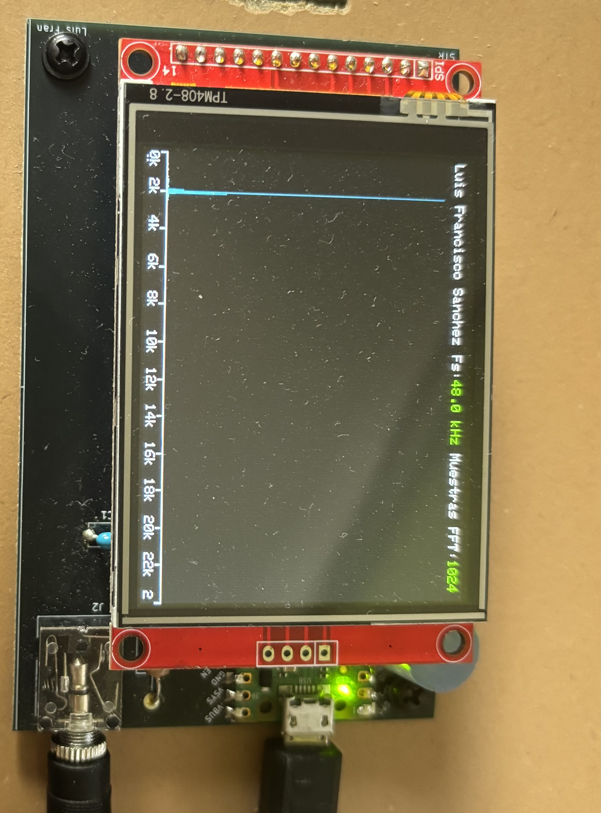

# Proyecto Pico-FFT: Transmisor FM y Analizador de Espectro Audible

  
  
  
  

  

> **Pico-FFT** es un sistema que combina un transmisor de radio FM analógico de baja potencia con un analizador de espectro de audio en tiempo real, todo gestionado por un microcontrolador Raspberry Pi Pico.  
> Un proyecto que fusiona el mundo de la radiofrecuencia analógica con el procesamiento digital de señales (DSP).

Desarrollado por **Luis Francisco Sánchez Turrión** para el Grado en Tecnologías de Telecomunicación de la Universidad de Valladolid (UVa).

---

##  Características principales

-    **Transmisión FM analógica:** Emisión en la banda comercial (88–108 MHz) con un módulo Cebek FM-1 modificado.
-    **Entrada de audio externa:** Permite transmitir audio desde cualquier fuente con conector jack de 3.5 mm (móvil, PC, etc.).
-    **Análisis de espectro en tiempo real:** Visualización instantánea del espectro de frecuencias del audio recibido.
-    **Procesamiento de alto rendimiento:**
    -   Captura de audio a **48 kHz** usando el ADC del RP2040 con **DMA** para no sobrecargar la CPU.
    -   Cálculo de una **FFT de 1024 puntos** con la librería `ARM CMSIS-DSP`, optimizada para el núcleo Cortex-M0+.
-    **Interfaz gráfica atractiva:** Una pantalla TFT a color de 2.8" (320x240) muestra el espectro de forma clara y fluida.
-    **Hardware personalizado:** Una PCB diseñada desde cero en KiCad integra todos los componentes de forma compacta y profesional.

---

##  ¿Cómo funciona?

El flujo de la señal es el siguiente:

1.  **Fuente de audio** `➡️` Un móvil reproduce música y la envía por su salida de auriculares.
2.  **Transmisor FM** `➡️` El módulo Cebek FM-1 recibe el audio, lo modula en frecuencia y lo transmite por el aire.
3.  **Receptor FM** `➡️` Una radio convencional sintoniza la frecuencia, demodula la señal y recupera el audio original.
4.  **Raspberry Pi Pico** `➡️` La salida de auriculares de la radio se conecta a la placa Pico-FFT. La Pico digitaliza el audio.
5.  **Procesamiento (FFT)** `➡️` La Pico aplica una ventana de Hamming y calcula la FFT para obtener las componentes de frecuencia.
6.  **Visualización** `➡️` El resultado se dibuja en la pantalla TFT como un gráfico de barras, actualizándose a ~17 FPS.

---

##  Hardware utilizado

| Componente                        | Descripción                                                                                              | Imagen                                       |
| --------------------------------- | -------------------------------------------------------------------------------------------------------- | -------------------------------------------- |
| **Módulo transmisor FM Cebek FM-1** | Mini-emisora FM de 100 mW. Modificada para aceptar una entrada de línea en lugar del micrófono integrado. |  |
| **Raspberry Pi Pico**             | El cerebro del analizador. Su chip RP2040 (ARM Cortex-M0+ dual-core) realiza todo el procesamiento digital. |              |
| **Pantalla TFT 2.8"**             | Display a color de 320x240 píxeles con controlador ILI9341. Conectada por SPI para un refresco rápido.    |           |

---

##  Diseño y montaje

### Modificación del transmisor FM

Para transmitir audio de alta calidad se deshabilitó el micrófono electret del módulo FM-1 y se implementó un circuito de entrada con conector jack de 3.5 mm, condensador de acoplo y potenciómetro para ajustar el nivel de modulación.

  

### Diseño de la PCB con KiCad

La placa principal del analizador fue diseñada en **KiCad 8.0** y fabricada por JLCPCB. Integra zócalos para la Pico y la pantalla, el circuito de acondicionamiento de audio y todos los conectores en una PCB compacta de doble capa.

| Esquema del circuito (KiCad) | Vista superior de la PCB | Vista inferior de la PCB |
| ----------------------------- | ------------------------ | ------------------------ |
|  |  |  |

---

##  Software y firmware

El firmware se desarrolló en C/C++ sobre el **entorno Arduino**, utilizando el core de Earle Philhower para RP2040.

### Entorno y librerías clave

-   **Arduino-Pico Core:** Proporciona la estructura `setup()` y `loop()` y facilita el manejo de periféricos estándar como SPI.
-   **RP2040 C SDK (`hardware/dma.h`, `hardware/adc.h`):** Usado para configurar el hardware a bajo nivel, permitiendo captura continua y rápida mediante DMA.
-   **`Adafruit_ILI9341` + `Adafruit_GFX`:** Librerías para controlar la pantalla TFT y dibujar gráficos de manera sencilla.
-   **`ARM CMSIS-DSP` (`arm_math.h`):** La librería clave para el rendimiento. Proporciona funciones DSP optimizadas que permiten calcular la FFT en milisegundos.

### Flujo de trabajo del firmware

1.  **Captura DMA:** Se inicia una transferencia DMA para llenar un buffer de 1024 muestras desde el ADC sin intervención de la CPU.
2.  **Espera:** El programa se bloquea hasta que el DMA confirma que el buffer está lleno.
3.  **Preprocesamiento:** Se aplica una **ventana de Hamming** a las muestras.
4.  **Cálculo FFT:** Se invoca `arm_rfft_fast_f32` para transformar los datos al dominio de la frecuencia.
5.  **Autoescala:** Se calcula la magnitud y se ajusta la escala vertical del gráfico.
6.  **Dibujo:** Se actualiza el gráfico de barras en la pantalla TFT.
7.  **Repetición:** Se vuelve al paso 1 para procesar el siguiente bloque.

---

##  Resultados y demostración

El sistema final es totalmente funcional y ofrece una visualización fluida y en tiempo real del espectro de audio.  
Las pruebas con diferentes tipos de señales (tonos puros, ondas complejas, música) demuestran la precisión y capacidad de respuesta del analizador.

| Transmisor en operación | Receptor sintonizado | Análisis de tono puro (2 kHz) | Análisis de onda de sierra (2 kHz) |
| ----------------------- | ------------------- | ----------------------------- | --------------------------------- |
|  |  |  |  |

---

